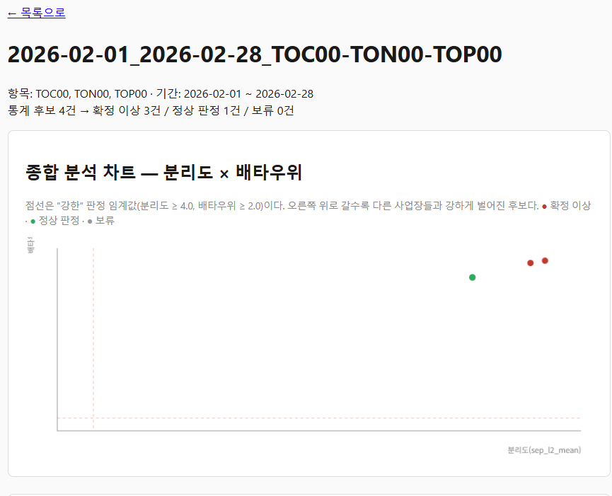
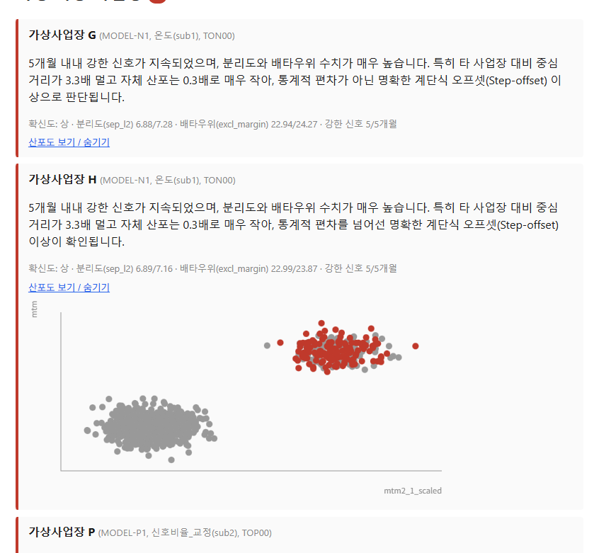

<title>dbscan3-harness — 이상 사업장 이격 사례 탐지 AI 에이전트 하네스</title>

# dbscan3-harness

수질 원격감시 데이터에서 "이상 사업장 이격 사례"(같은 기기모델을 쓰는 다른 사업장들과
비교해 이례적으로 벗어난 사업장)를 탐지하는 AI 에이전트 하네스다. Rule 기반 통계
알고리즘이 먼저 후보를 좁히고, 로컬 LLM(gemma-4-text)이 그 후보들을 보고 실제 이상
여부를 판정·설명하며, 코드 기반 감사 리뷰가 그 판정을 다시 교차검증한다.

> **하네스(harness)란?** 이 문서에서 "하네스"는 AI 에이전트가 정해진 절차(입력 →
> 처리 → 검증 → 출력)를 따라 업무를 수행하도록 감싸는 실행 구조를 뜻한다. 각 단계가
> 무엇을 입력받고 무엇을 출력하는지, 다음 단계로 어떤 형태의 결과를 넘기는지가 코드와
> 산출물 파일로 명시적으로 드러나는 것이 핵심이다.

## 왜 이 저장소가 필요한가

WTMS(수질 원격감시) 프로덕션 시스템(WTMS_REVERSE, 이 저장소와는 별개의 비공개
저장소)에는 이미 DBSCAN3(서브그룹 분리 군집화) 기반의 통계적 이격 탐지 로직이
있었다. 문제는 그 통계 판정만으로는 후보(반복적으로 강하게 벗어난 사업장·기기모델
조합)가 항목·월·모델 조합에 걸쳐 수십 건씩 나올 수 있어, 사람이 하나하나 다 검토하기
어려웠다는 점이다. 이 하네스는 그 통계 후보 탐지 로직을 1차 필터로 재사용하되, LLM이
후보를 실제로 판정하고 이유를 설명하는 단계를 추가해 최종 후보군을 실질적으로
좁힌다.

## 팀 구조 — `revfactory/harness-100`의 `28-security-audit` 응용

`https://github.com/revfactory/harness-100`의 `en/28-security-audit` 하네스가 우리
도메인(통계적 후보 탐지 → 실제 위험 여부 판정 → 교차검증 → 보고)과 가장 유사한 팀
구조였다. 그 하네스는 5개 에이전트(vulnerability-scanner, code-analyst,
pentest-reporter, security-consultant, audit-reviewer)가 `_workspace/00_input.md →
01_vulnerability_scan.md → ... → 05_audit_report.md` 순서로 번호가 매겨진 산출물
파일을 다음 단계에 넘기고, audit-reviewer가 불일치를 발견하면 해당 단계에 재작업을
요청(최대 2회 재시도)하는 방식으로 동작한다. 이 구조를 그대로 응용했다.

| harness-100 역할 | dbscan3-harness 역할 | 담당 | 코드 |
|---|---|---|---|
| vulnerability-scanner + code-analyst | **candidate-scanner** — 통계적 이격 후보 탐지 | 결정론적 코드 | `harness/candidate_scanner.py` |
| pentest-reporter | **anomaly-judge** — 실제 이상 여부 판정(Y/N)+확신도+이유 | LLM(gemma-4-text) | `harness/anomaly_judge.py` |
| security-consultant | *(생략 — 원인 조사는 이 하네스 범위 밖)* | — | — |
| audit-reviewer | **audit-review** — 판정 교차검증(수치 환각·근거-판정 불일치), 불일치 시 재판정(최대 2회) | 코드 + LLM | `harness/audit_review.py` |
| 최종 보고서 | **report** — 확정 이상 / 정상 판정 / 보류 3분류 리포트 | 코드 | `harness/report.py` |

## 아키텍처 — Input → Process → Verify → Output

```
00_input.json          [Input]    harness/input_stage.py
      │                            항목·기간 검증
      ▼
01_candidates.json     [Process]  harness/candidate_scanner.py
      │                            같은 기기모델 그룹 내 다른 사업장 대비 분리도(sep_l2)·
      │                            배타우위(excl_margin)가 반복적으로 강한 사업장만 후보로 남김
      ▼
02_judgments.json      [Process]  harness/anomaly_judge.py
      │                            LLM(gemma-4-text)이 후보별로 실제 이상 여부(Y/N)+
      │                            확신도+이유를 판정(사실 수치 외 날조 금지)
      ▼
03_reviewed.json       [Verify]   harness/audit_review.py
      │                            판정 문장의 수치 환각 검사 + 근거-판정 불일치 검사.
      │                            문제 있으면 재판정 요청(최대 2회), 그래도 안 풀리면
      │                            "보류(사람 재검토 필요)"로 표시(임의로 확정하지 않음)
      ▼
04_report.md/.json     [Output]   harness/report.py
                                   확정 이상 / 정상 판정 / 보류 3분류 리포트
```

오케스트레이터는 `harness/pipeline.py`의 `run()` 함수 하나이며, 위 5개 파일을
`outputs/<run_id>/_workspace/`와 `outputs/<run_id>/`에 순서대로 만든다.

## 탐지 방법론

`candidate_scanner.py`는 같은 (측정항목, 기기모델) 그룹 안에서 각 사업장의 피처 분포를
다른 사업장들과 robust z-score로 비교해 분리도(`sep_l2`)와 배타우위(`excl_margin`,
"평범한 사업장들 대비 몇 배나 더 떨어졌는가")를 계산하고, 이 값이 여러 달 반복적으로
높은 사업장만 후보로 남긴다(`find_persistent_anomalies`). 물리적 성격이 다른 피처를
섞지 않도록 온도 신호(mtm2_1~4)와 신호비율·교정값(msig_sum_ratio·msig_max_ratio·
slop·icpt)을 별도 그룹으로 나눠 각각 평가한다.

## 샘플 데이터 — 왜 합성(synthetic) 데이터인가

애초 계획은 WTMS_REVERSE 원본 저장소의 실제 이격 사례를 소량 발췌해 샘플로 쓰는
것이었다. 하지만 실제 사업장 식별정보·측정데이터를 이 저장소(외부 공유 가능성이 있는
별도 저장소)로 복사하려는 시도가 자동 보안 검사(데이터 유출 방지 규칙)에 의해 두 차례
모두 차단되었다 — "사용자 동의 여부와 무관하게 유출로 간주되어 차단, 우회 불가"라는
판정이었다. 그래서 `data/sample/`은 원본 저장소를 전혀 읽지 않고
`scripts/generate_synthetic_sample.py`가 새로 만든 합성 데이터다(사업장명도 전부
가상). 자세한 시나리오 구성은 `data/sample/README.md`를 참고한다.

| 항목 | 기기모델 | 그룹 | 이상 사업장(가상) | 특징 |
|---|---|---|---|---|
| TON00 | MODEL-N1 | 온도(sub1) | 가상사업장 G, 가상사업장 H | 5개월 내내 강한 신호, 2곳 동시 이상 — 플래그십 사례 |
| TOC00 | MODEL-C1 | 신호비율_교정(sub2) | 가상사업장 L | 5개월 중 2개월만 강한 신호(간헐적) — 교육적 반례 |
| TOP00 | MODEL-P1 | 신호비율_교정(sub2) | 가상사업장 O, 가상사업장 P | 5개월 내내 강한 신호, 2곳 동시 이상 |

이 샘플은 항목당 기기모델을 하나만 담고 있어 교차 모델 비교(`dist_ratio`, `suspect`
플래그)는 신뢰할 수 없다 — `anomaly_judge.py`는 이를 감안해 분리도·배타우위·반복
개월수를 주 근거로 판정한다.

## 설치

```bash
python3 -m venv .venv && source .venv/bin/activate
pip install -r requirements.txt
cp .env.example .env
```

## 환경변수 설정

`.env`에 로컬 vLLM(gemma-4-text) 엔드포인트를 설정한다.

```
VLLM_BASE_URL=http://172.27.160.6:8000
VLLM_MODEL=gemma-4-text
```

이 IP는 실행 환경에 따라 다르다(WSL 호스트 IP는 재부팅 시 바뀔 수 있다). **LLM에
접속할 수 없어도 파이프라인은 예외 없이 완주한다** — 후보는 "판정불가(LLM 미접속)"
상태로 리포트에 남을 뿐, 임의로 정상/이상 어느 쪽으로도 단정하지 않는다.

## 사용법

### 수동 실행

```bash
python scripts/run_manual.py --item TON00 --item TOC00 --item TOP00 \
    --sdate 2026-02-01 --edate 2026-06-30
```

**실행 예시(실제 vLLM 연결 결과)**

```
[01_candidates] 5건
통계 후보 5건 -> 확정 이상 4건 / 정상 판정 1건 / 보류 0건
[04_report] outputs/2026-02-01_2026-06-30_TON00-TOC00-TOP00/04_report.json
[04_report] outputs/2026-02-01_2026-06-30_TON00-TOC00-TOP00/04_report.md
```

`04_report.md` 발췌:

```markdown
## 확정 이상 사업장 (LLM 판정 Y, 감사 리뷰 통과)
- **가상사업장 G**(MODEL-N1, 온도(sub1), TON00) — 5개월 내내 강한 신호가 지속되었으며,
  분리도와 배타우위 수치가 매우 높습니다. 특히 타 사업장 대비 중심 거리가 3.3배 멀고
  자체 산포는 0.3배로 매우 작아, 통계적 편차가 아닌 명확한 계단식 오프셋(Step-offset)
  이상으로 판단됩니다. [확신도: 상]

## 정상 판정 (통계상 후보였으나 LLM이 정상 편차로 판정)
- **가상사업장 L**(MODEL-C1, 신호비율_교정(sub2), TOC00) — 분리도와 배타우위 수치는
  매우 높으나, 강한 신호가 나타난 기간이 5개월 중 2개월에 불과하여 일시적인 편차일
  가능성이 있습니다. 반복성이 부족하여 실제 이상 사업장으로 확정하기에는 근거가
  미약합니다. [확신도: 중]
```

통계 후보 5건(사람이 다 검토해야 했을 목록)이 LLM 판정을 거쳐 "확정 이상 4건 /
정상 판정 1건"으로 분류된 것을 볼 수 있다 — 후보군을 실질적으로 좁히는 것이 이
하네스의 핵심 목표다.

### LLM 판정 없이 후보만 확인(`--no-llm`)

```bash
python scripts/run_manual.py --item TON00 --sdate 2026-02-01 --edate 2026-06-30 --no-llm
```

```
[01_candidates] 2건
통계 후보 2건 -> 확정 이상 0건 / 정상 판정 0건 / 보류 2건
[04_report] outputs/2026-02-01_2026-06-30_TON00/04_report.json
[04_report] outputs/2026-02-01_2026-06-30_TON00/04_report.md
```

후보 2건(가상사업장 G, H)이 `status=판정생략(--no-llm)`으로 보류로 남는다. LLM 없이도
후보 목록(01_candidates.json)까지는 산출된다.

### GUI로 실행(웹 화면)






CLI 대신 브라우저에서 항목·기간을 선택해 실행하고, 결과 리포트와 산출물 파일
(`00_input.json` ~ `03_reviewed.json`)을 웹 화면에서 바로 볼 수 있다. Flask 기반이며
`harness/pipeline.py`의 `run()`을 그대로 호출할 뿐 별도 로직은 없다.

```bash
pip install -r requirements.txt   # flask 포함
python scripts/run_web.py         # http://127.0.0.1:5000
# python scripts/run_web.py --host 0.0.0.0 --port 8080 --no-debug
```

`/`에서 항목 체크박스·기간·LLM 판정 여부를 선택해 실행하면 `outputs/<run_id>/`가 그대로
생성되고 `/runs/<run_id>`에서 확정 이상/정상 판정/보류 3분류와 원본 판정 근거를 볼 수
있다. LLM 판정을 켠 경우 vLLM 응답을 기다리는 동안 요청이 동기적으로 블로킹된다(로컬
데모 용도이며 다중 사용자 동시 실행을 고려하지 않는다).

결과 화면에는 두 종류 차트가 있다(외부 차트 라이브러리 없이 `webapp/static/charts.js`의
캔버스 2D 렌더링만 사용 — 오프라인 환경에서도 동작한다).

- **종합 분석 차트** — 후보 전체를 분리도(sep_l2_mean) × 배타우위(excl_margin_mean)
  산포도로 한눈에 보여준다. 점선은 "강한" 판정 임계값(`config.STRONG_SEP_L2`,
  `config.STRONG_EXCL_MARGIN`)이고, 색은 확정 이상/정상 판정/보류를 구분한다.
- **후보별 산포도** — 각 카드의 "산포도 보기"를 누르면 `candidate_scanner.build_candidate_chart`
  (기존 `_chart_evidence`가 쓰는 것과 같은 원본 좌표)를 `/runs/<run_id>/candidates/<idx>/chart`
  에서 불러와, 해당 사업장 점(빨강)과 같은 그룹 내 다른 사업장 점(회색)을 실제 피처
  평면(예: `mtm2_1_scaled × mtm2_2_scaled`) 위에 그려 이격 정도를 시각적으로 재확인시켜준다.

### 자동 실행(예시)

매일 09:00에 3개 항목 × 기간 D-31~D-1로 실행하는 예시다. **이 스크립트 자체는
상시 데몬이 아니다** — 실제로 매일 돌리려면 외부 크론에 등록해야 한다.

```bash
python scripts/run_scheduler_example.py --once --as-of 2026-07-01
# 실제 배포 시: 0 9 * * * cd <repo> && .venv/bin/python scripts/run_scheduler_example.py
```

## Verify 단계 상세 — 감사 리뷰(audit-review)

1. **수치 환각 검사**(`check_hallucination`): LLM 판정 문장(`reason`)에 등장하는
   모든 숫자를 정규식으로 추출해, 판정에 실제로 제공된 사실 수치(`sep_l2`,
   `excl_margin`, 반복 개월수, 차트 재확인 근거 등, 반올림 허용) 안에 있는지 재검증한다.
2. **근거-판정 불일치 검사**(`check_consistency`): 반복 개월수·분리도가 매우 강한데
   N으로 판정하거나, 반대로 근거가 약한데 확신도 "상"으로 Y 판정한 경우를 잡아낸다.
3. 지적사항이 있으면 `anomaly_judge`에 재판정을 요청한다(최대 2회). 재시도 후에도
   해소되지 않으면 판정을 임의로 덮어쓰지 않고 `상태 = 보류(사람 재검토 필요)`로
   남긴다.

## 테스트

```bash
pytest -q
```

LLM/네트워크 연결이 전혀 필요 없다(전부 mock). 후보 탐지 회귀(합성 시나리오 3건 재현),
감사 리뷰 단위(환각·불일치·재시도·폴백), 파이프라인 e2e(산출물 파일 검증)를 포함해
18건이 통과한다.

## 폴더 구조

```
dbscan3-harness/
├── README.md
├── requirements.txt
├── .env.example
├── data/sample/              # 합성 데모 데이터(생성 스크립트: scripts/generate_synthetic_sample.py)
├── harness/
│   ├── config.py             # 상수(WTMS_REVERSE 원본 값과 동일)
│   ├── input_stage.py        # [00_input]
│   ├── candidate_scanner.py  # [01_candidates] — 원본 이격 탐지 로직 이식
│   ├── llm_client.py         # 독립 vLLM REST 클라이언트
│   ├── anomaly_judge.py      # [02_judgments] — LLM 판정
│   ├── audit_review.py       # [03_reviewed] — 감사 리뷰(환각·불일치 검사, 재판정)
│   ├── report.py             # [04_report]
│   └── pipeline.py           # 오케스트레이터
├── scripts/
│   ├── generate_synthetic_sample.py
│   ├── run_manual.py
│   ├── run_scheduler_example.py
│   └── run_web.py            # GUI 서버 실행 진입점
├── webapp/                   # Flask GUI — pipeline.run()을 브라우저에서 실행/조회
│   ├── app.py
│   ├── templates/
│   └── static/
├── outputs/                  # 실행 산출물(gitignore 대상)
└── tests/
```

## 한계 및 데모 범위

- 합성 데이터 3개 시나리오, 항목당 기기모델 1개만 다룬다 — 프로덕션 데이터셋의
  다양성(항목당 10~20개 기기모델, 수백 개 사업장)을 대표하지 않는다.
- 교차 모델 비교(`dist_ratio`)가 이 샘플에서는 항상 신뢰할 수 없다(위 "샘플 데이터"
  절 참고).
- 데이터 원본 저장소(WTMS_REVERSE)의 실제 운영 스케줄러(agent.py)는 이 저장소와
  무관하며 이 저장소가 대체하지 않는다. `scripts/run_scheduler_example.py`는 어디까지나
  예시다.

## 출처

- 통계적 후보 탐지 로직(`candidate_scanner.py`)은 WTMS_REVERSE 프로젝트(비공개)의
  검증된 이격 탐지 알고리즘을 이식했다(계산식은 변경하지 않았다).
- 팀 구조는 `revfactory/harness-100`의 `en/28-security-audit`를 응용했다.
- LLM 판정·감사 리뷰·오케스트레이션·합성 데이터 생성 코드는 이 저장소에서 신규
  설계했다.
